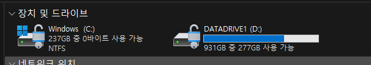
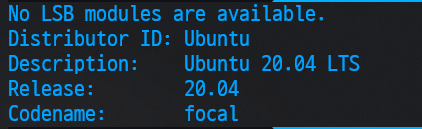
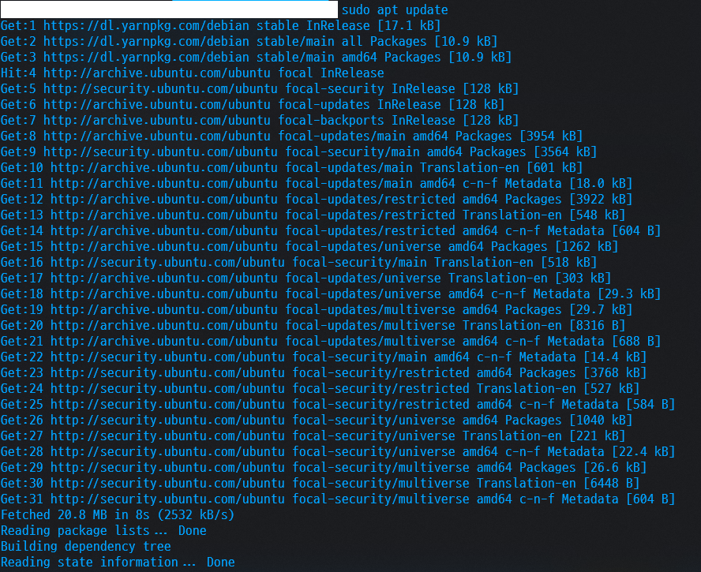
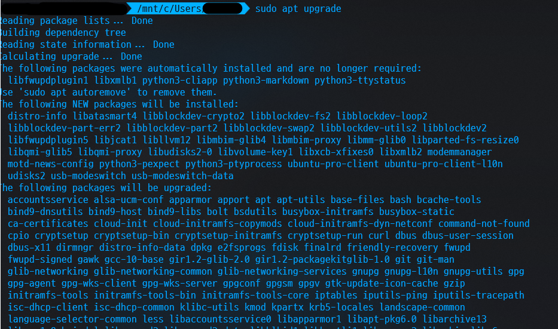
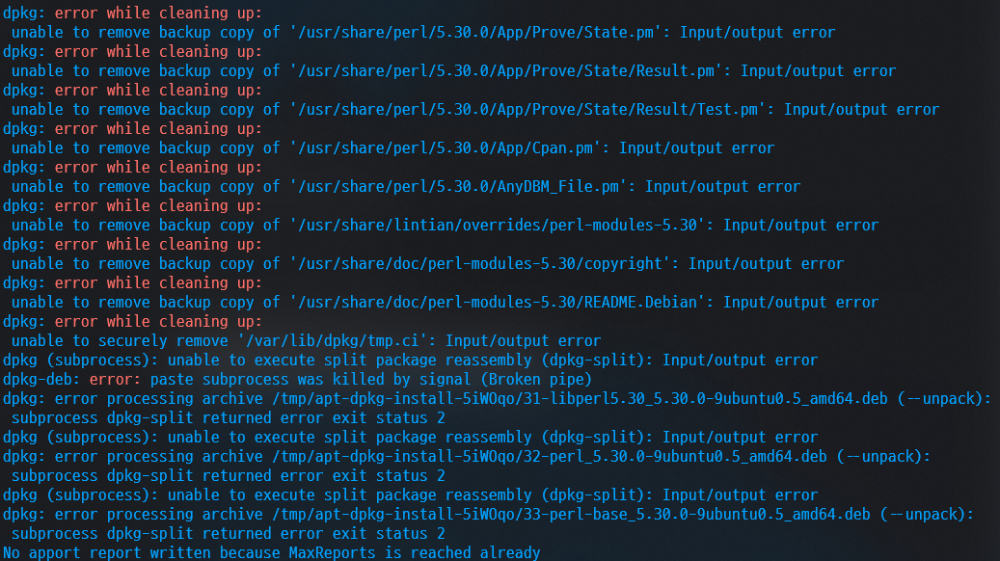
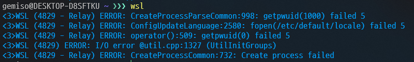
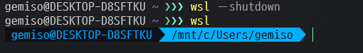
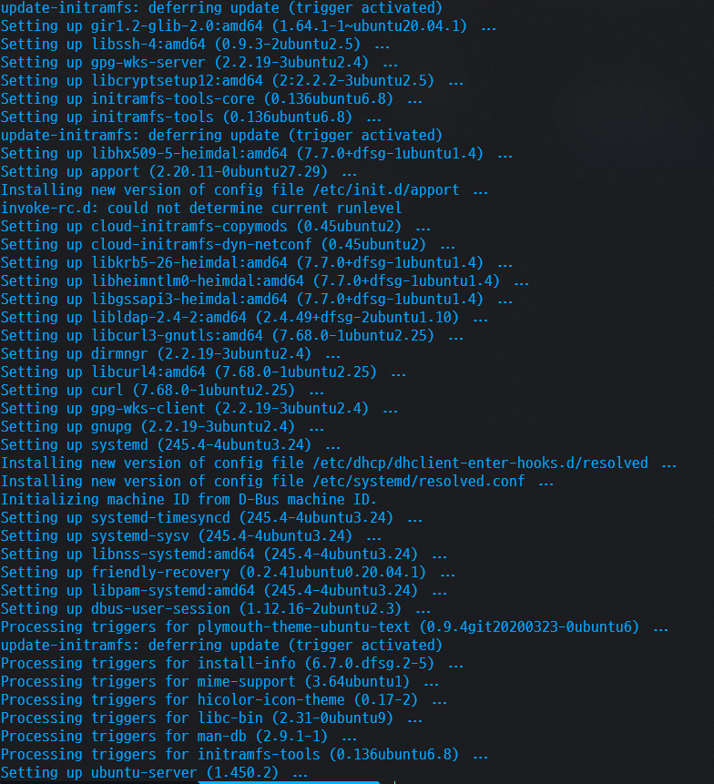
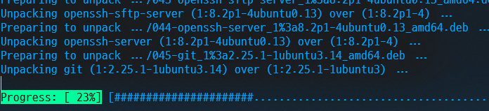
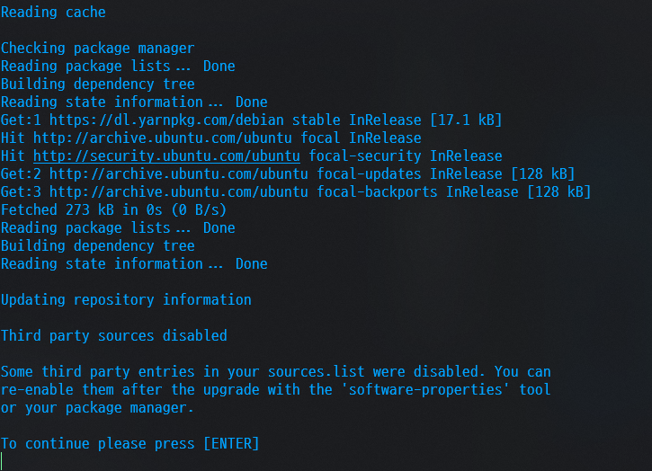

# WSL 우분투 드라이브 이동...하기 전에 일단 22.04 LTS로 업그레이드

### 현상..



### 현재 우분투 버전

``` terminal
lsb_release -a
```



> `20.04 LTS` 로 확인

```
  cat /etc/os-release
NAME="Ubuntu"
VERSION="20.04.6 LTS (Focal Fossa)"
ID=ubuntu
ID_LIKE=debian
PRETTY_NAME="Ubuntu 20.04.6 LTS"
VERSION_ID="20.04"
HOME_URL="https://www.ubuntu.com/"
SUPPORT_URL="https://help.ubuntu.com/"
BUG_REPORT_URL="https://bugs.launchpad.net/ubuntu/"
PRIVACY_POLICY_URL="https://www.ubuntu.com/legal/terms-and-policies/privacy-policy"
VERSION_CODENAME=focal
UBUNTU_CODENAME=focal
```


### 업데이트 보류 중 패키지 확인

``` terminal
sudo apt-mark showhold
```


### 패키지 최신버전으로 업데이트

`sudo apt update` 


`sudo apt upgrade` 




> 뭔가 에러가 많이 나는 모습.
> 확인해보니 회사 내부망에서 사용중이었다 .. 😢


> 내부망 풀고 와이파이로 재시도 했으나 WSL 접속이 되지 않는다🤔 이런 오류가 ..


> 터미널 종료 후 다시 시도 한 모습.. 


> WSL을 완전히 종료 후 다시 실행하니 되었다.

``` terminal
 /mnt/c/Users/  sudo apt upgrade
[sudo] password for :
E: dpkg was interrupted, you must manually run 'sudo dpkg --configure -a' to correct the problem.
```
> upgrade 도중 비정상적인 종료로 판단되어 수동 처리하라는 에러가 나온다.

``` terminal
sudo dpkg --configure -a
```

> 정상 처리 된 모습


> 다시 `sudo apt upgrade`로 업그레이드 해줌.

```
Processing triggers for ca-certificates (20240203~20.04.1) ...
Updating certificates in /etc/ssl/certs...
0 added, 0 removed; done.
Running hooks in /etc/ca-certificates/update.d...
done.
Processing triggers for libc-bin (2.31-0ubuntu9.18) ... 
```
> apt upgrade 완료 모습


``` 
> sudo apt dist-upgrade

Reading package lists... Done
Building dependency tree
Reading state information... Done
Calculating upgrade... Done
The following packages were automatically installed and are no longer required:
  libfwupdplugin1 libxmlb1 python3-cliapp python3-markdown python3-ttystatus
Use 'sudo apt autoremove' to remove them.
0 upgraded, 0 newly installed, 0 to remove and 0 not upgraded.
```
> 명령어로 최신 배포 버전을 사용할 수 있는지 확인
> 근데 오토리무브로 저것들을 삭제하라네? 그냥 삭제 해보자

```
  sudo apt autoremove
Reading package lists... Done
Building dependency tree
Reading state information... Done
The following packages will be REMOVED:
  libfwupdplugin1 libxmlb1 python3-cliapp python3-markdown python3-ttystatus
0 upgraded, 0 newly installed, 5 to remove and 0 not upgraded.
After this operation, 1240 kB disk space will be freed.
Do you want to continue? [Y/n] Y
(Reading database ... 49577 files and directories currently installed.)
Removing libfwupdplugin1:amd64 (1.5.11-0ubuntu1~20.04.2) ...
Removing libxmlb1:amd64 (0.1.15-2ubuntu1~20.04.1) ...
Removing python3-cliapp (1.20180812.1-3build1) ...
Removing python3-markdown (3.1.1-3) ...
Removing python3-ttystatus (0.38-4) ...
Processing triggers for man-db (2.9.1-1) ...
Processing triggers for libc-bin (2.31-0ubuntu9.18) ...
```


```
  sudo apt install update-manager-core
Reading package lists... Done
Building dependency tree
Reading state information... Done
update-manager-core is already the newest version (1:20.04.10.23).
update-manager-core set to manually installed.
0 upgraded, 0 newly installed, 0 to remove and 0 not upgraded.
```
> update-manager-core 설치


```
 - Prompt 값이 LTS로 되어있지 않은 경우 LTS로 변경
sudo vi /etc/update-manager/release-upgrades
```


```
sudo do-release-upgrade -d
```
```
  sudo do-release-upgrade -d
Checking for a new Ubuntu release
There is no development version of an LTS available.
To upgrade to the latest non-LTS development release
set Prompt=normal in /etc/update-manager/release-upgrades.

새 Ubuntu 릴리스 확인 중
사용 가능한 LTS의 개발 버전이 없습니다.
LTS가 아닌 최신 개발 릴리즈로 업그레이드하려면 다음과 같이 하세요.
etc/update-manager/release-upgrades에서 Prompt=normal을 설정합니다.
```
> 어라? 사용 가능한 LTS가 없다..?
> 그냥 `sudo do-release-upgrade` 사용하니까 일단 실행 됨 



ㅁㄴㅇ


## 출처 및 참조 
> https://goddaehee.tistory.com/314

